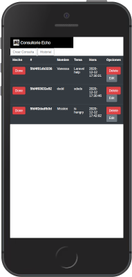
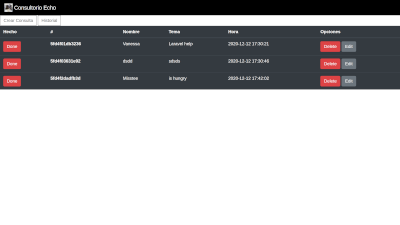

# Consultorio Echo

Desarrollar una aplicación "CRUD" Web en PHP que permita pedir cita a los desarrolladores y equipos para solucionar problemas técnicos con la ayuda del formador o CTO.

## Team
- [Joseph](https://github.com/JosephCrespin)
- [Laura](https://github.com/Nau-crc)
- [Quim](https://github.com/Joaquim-Frances)
- [Vanessa](https://github.com/vanessacor)

## Screen Shots

## Project Requirements

- Aplicación de tipo CRUD (Create, Read, Update, Delete) y en Ajax. (Api Rest)
- Deberá ser Orientada a objetos con el patrón MVC
- Deberá estar en un servidor gratuito en producción.
- Se debe usar Git con buenas prácticas en los commits.
- El repositorio debe contener un Readme con explicación del proyecto, y una explicación de cómo instalar o ejecutar la aplicación.
- Un logger para poder auditar el funcionamiento de la aplicación. Debe hacer un ‘log’ cada vez que pasa alguna acción CRUD
- Tests Unitarios desde los servicios a los repositorios (desacoplar de la base de datos)
- Funcionalidad para marcar las citas ya realizadas.    

## Technologies

- Frontend: HTML, CSS.
- Backend: [PHP](https://www.php.net/).
- Databse: [MySQL](https://www.mysql.com/).

## Required

- PHP 7.4
- Composer

## Getting Started

- composer install

## Run Tests

- vendor/bin/phpunit

